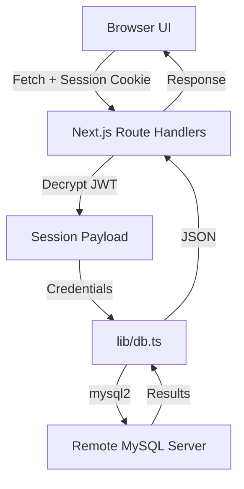

# Architecture

**Analysis Date:** 2026-04-01

## System Overview

The MySQL GUI is a **Next.js 14 Web Application** using the **App Router** architecture. It follows a classic Single Page Application (SPA) pattern within a specific dashboard route, where state transitions are managed by React hooks.

## Frontend Architecture

**Component Structure:**
- **Layout:** `app/layout.tsx` - Global providers and base HTML structure.
- **Dashboard Orchestrator:** `app/dashboard/page.tsx` - The main state container. It manages:
    - Current database selection.
    - Current table selection.
    - Current active view (e.g., browse, structure, SQL editor).
- **Sub-Views:** Components like `TableData`, `SqlEditor`, and `DbOverview` are rendered conditionally based on the orchestrator's state.
- **Navigation:** `Sidebar` handles database and object selection through callbacks.

**State Management:**
- **Local State:** Uses standard React `useState` for UI transitions.
- **Refresh Sync:** Incorporates a `refreshKey` state incremented in parents (like `page.tsx` on Mock Data generation success) to trigger `useEffect` re-fetches in child data tables (`TableData.tsx`).
- **Context:** `ThemeProvider` manages UI theme.
- **Server Communication:** Standard `fetch` calls to Next.js API routes.

## Backend Architecture (API Layer)

**Pattern:** Route Handlers (`app/api/*/route.ts`)
- The backend is a thin adapter between the frontend and the MySQL server.
- **Statelessness:** Connection details are *not* stored on the server disk; they are extracted from the user's JWT session.
- **Database Compatibility:** Fallback handlers exist for metadata endpoints. For example, if retrieval of stored procedures/functions fails due to legacy MariaDB `mysql.proc` schema version mismatches (e.g. column count errors), the route handler catches the exception and falls back to a sequence of `SHOW STATUS` and `SHOW CREATE` statements, normalizing the output payload.
- **Execution Flow:**
    1. Authenticate session (`getSession`).
    2. Extract connection params (host, user, etc.).
    3. (Optional) Sanitize/Check query for destructive commands.
    4. Create `mysql2` connection.
    5. Execute and return results.
    6. Close connection.

## Security Architecture

**Session Management:**
- Uses **Encrypted JWTs** stored in `httpOnly` cookies.
- This ensures that database credentials are never exposed to the client-side JavaScript.

**Query Safety:**
- **Destructive Detection:** `lib/sanitize.ts` detects SQL commands like `DROP`, `TRUNCATE`, and `DELETE`.
- **Confirmation Flow:** API routes require a `confirmed: true` flag for destructive queries, prompting the UI to show a confirmation modal.

## Data Flow

---

*Architecture analysis: 2026-04-01*
*Update after changing system design*
