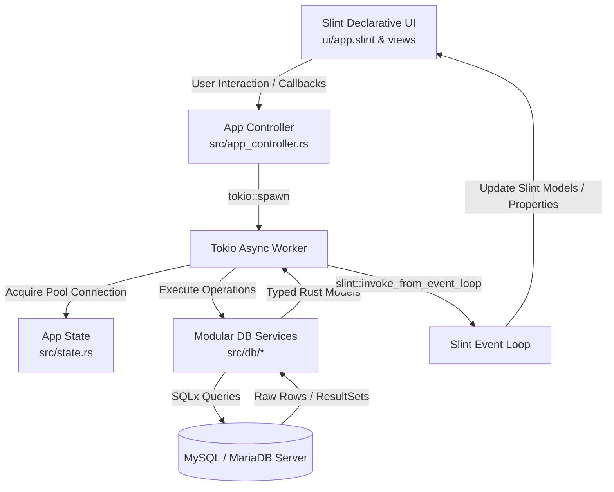

# Architecture

**Analysis Date:** 2026-10-03 (v3.0.0 Native Rust + Slint Rewrite)

## System Overview

The MySQL GUI is a **high-performance native desktop application** built with **Rust** and **Slint UI 1.18**. The application operates as a single compiled binary without any web runtime or browser abstraction. 

The architecture cleanly decouples:
1. **Slint Declarative UI (`ui/`):** Hardware-accelerated layouts, property bindings, and user event dispatchers.
2. **Controller & State Coordinator (`src/app_controller.rs` & `src/state.rs`):** Bidirectional bridge forwarding UI events to async background tasks and pushing typed models back into the Slint event loop.
3. **Database Engine (`src/db/`):** Asynchronous, connection-pooled MySQL operations managed by `sqlx`.

---

## Frontend Architecture (`ui/`)

### Window & View Routing
* **Root Container:** [`ui/app.slint`](file:///home/coes/Projects/MYSQL%20GUI/ui/app.slint) defines `AppWindow`.
* **View Router:** Conditionals dynamically mount the login view (`!is-logged-in`) or the dashboard workspace (`is-logged-in`).
* **Dashboard Split:**
  * **TopBar:** Server badge, dynamic database/table breadcrumbs, theme switcher, and logout.
  * **Sidebar:** Tree of databases, tables, and views with live count badges and action buttons.
  * **Right Work Area:** Dynamic tab bar for current context (Structure, Data, SQL Editor, Operations, Diagram) and view container mounting one of 18 views from `ui/views/`.

### Design System & Components
* **Design Tokens:** [`ui/theme.slint`](file:///home/coes/Projects/MYSQL%20GUI/ui/theme.slint) centralizes the terminal-core dark palette (`#0d0d0d`, `#161616`, `#222222`), electric green accent (`#00ff9d`), typography, and border metrics.
* **Component Library:** [`ui/components/`](file:///home/coes/Projects/MYSQL%20GUI/ui/components/) contains reusable widgets (`button.slint`, `card.slint`, `dialog.slint`, `input.slint`).

---

## Backend Architecture (`src/`)

### Entry Point & Lifecycle
* **[`src/main.rs`](file:///home/coes/Projects/MYSQL%20GUI/src/main.rs):**
  Instantiates `AppWindow::new()`, wraps state in `Arc<Mutex<AppState>>`, invokes `AppController::setup()`, and starts the Slint main event loop (`window.run()`).

### Controller & Dispatcher
* **[`src/app_controller.rs`](file:///home/coes/Projects/MYSQL%20GUI/src/app_controller.rs):**
  Registers closures for every Slint callback (`connect`, `select_database`, `select_table`, `run_query`, `prev_page`, `next_page`, etc.).
  Operations that touch I/O or the database are dispatched via `tokio::spawn`.
  Results are safely pushed back onto the GUI thread via `slint::invoke_from_event_loop`.

### Modular Database Services (`src/db/`)
* **`auth.rs`:** Connection string construction, SSL options, ping verification, and OS keyring storage via `keyring-rs`.
* **`database.rs`:** Catalog querying (`SHOW DATABASES`), database creation, and drop operations.
* **`table.rs`:** Table extraction, row count approximations, and column schema introspection (`information_schema.COLUMNS`).
* **`data.rs`:** Paginated row queries with limit/offset, column-based sorting, and inline primary-key row deletion.
* **`query.rs`:** Execution of raw user SQL queries, multi-statement batching, duration telemetry, and tabular column/row mapping.
* **`server.rs`:** Live metrics (`SHOW GLOBAL STATUS`) and process list retrieval (`SHOW FULL PROCESSLIST`).
* **`history.rs`:** Disk-persistent query log with favorite toggles.
* **`sanitize.rs`:** Identifier backtick escaping and destructive keyword detection.

---

## Security Architecture

* **Zero Plaintext Secrets on Disk:** Database credentials (user/password/host/port) are encrypted directly in the OS Keyring via `keyring-rs` (Linux SecretService, macOS Keychain, Windows Credential Manager).
* **Destructive Operation Guard:** SQL queries containing `DROP`, `TRUNCATE`, or `DELETE` trigger a modal confirmation dialog (`ConfirmDialog` in `app.slint`) before execution.
* **Identifier Escaping:** All dynamically constructed table/column queries use `sanitize_identifier()` to wrap inputs in backticks and escape embedded quotes.

---

## Data Flow Diagram

```mermaid
flowchart TD
    UI[Slint Declarative UI<br/>ui/app.slint & views] -->|User Interaction / Callbacks| Ctrl[App Controller<br/>src/app_controller.rs]
    Ctrl -->|tokio::spawn| Async[Tokio Async Worker]
    Async -->|Acquire Pool Connection| State[App State<br/>src/state.rs]
    Async -->|Execute Operations| DB[Modular DB Services<br/>src/db/*]
    DB -->|SQLx Queries| MySQL[(MySQL / MariaDB Server)]
    MySQL -->|Raw Rows / ResultSets| DB
    DB -->|Typed Rust Models| Async
    Async -->|slint::invoke_from_event_loop| UI_Thread[Slint Event Loop]
    UI_Thread -->|Update Slint Models / Properties| UI
```
